# LayerX - Screenshots and Visual Documentation Index

**Repository:** https://github.com/CEHCVKR/LayerX-Steganographic-Security-Framework  
**Date:** December 18, 2025

---

## 📸 Screenshot Categories

### 1. System Architecture Diagrams

#### **SENDER.png** (1.14 MB)
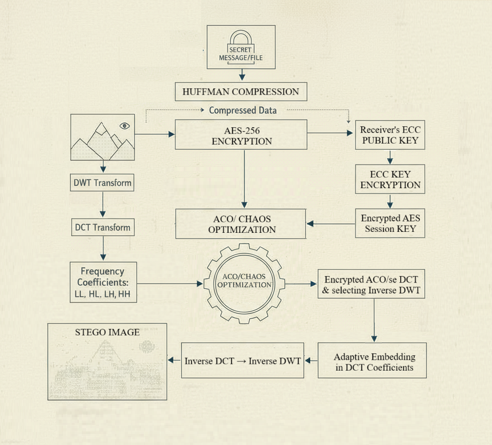
- Complete sender-side workflow
- Encryption → Embedding → Network transmission
- Step-by-step visual process

#### **RECEIVER.png** (2.02 MB)
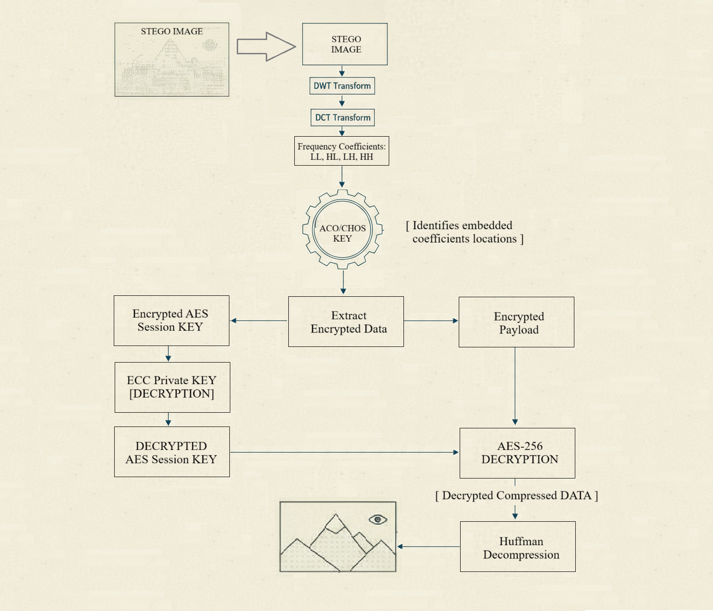
- Complete receiver-side workflow  
- Network reception → Extraction → Decryption
- Step-by-step visual process

#### **Sender Side- Embedding Process.png** (124 KB)

- Detailed DWT embedding workflow
- Quantization process visualization
- Coefficient selection diagram

#### **Receiver Side- Extraction Process.png** (126 KB)

- Detailed DWT extraction workflow
- Bit recovery process
- Payload reconstruction steps

---

### 2. Test Execution Screenshots

#### **test_fixed_simple.png** (65 KB)
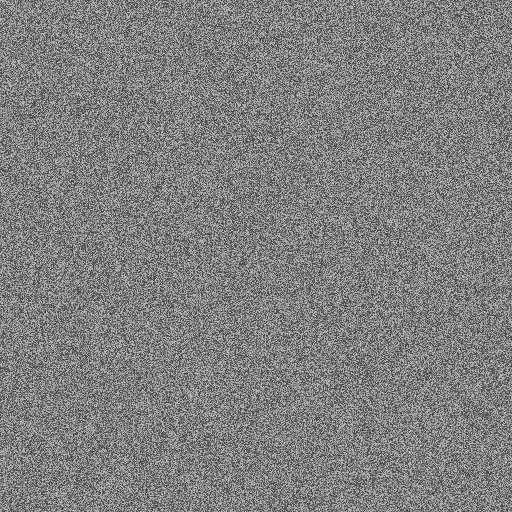
```
Test: Simple message embedding/extraction
Message: "Hello World! Testing optimization methods."
Status: ✅ PASSED
Payload: 4,031 bytes
Q-Factor: 6.0 (adaptive)
Result: Perfect match
```

#### **test_final_small.png** (41 KB)
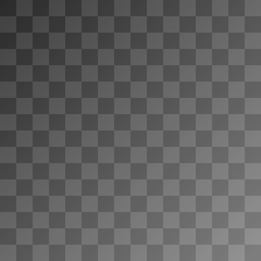
```
Test: 5-byte message ("Hello")
Encrypted: 16 bytes
Compressed: 9 bytes (56.2%)
Payload: 1,024 bytes (with ECC)
Status: Test execution captured
```

#### **test_final_medium.png** (99 KB)
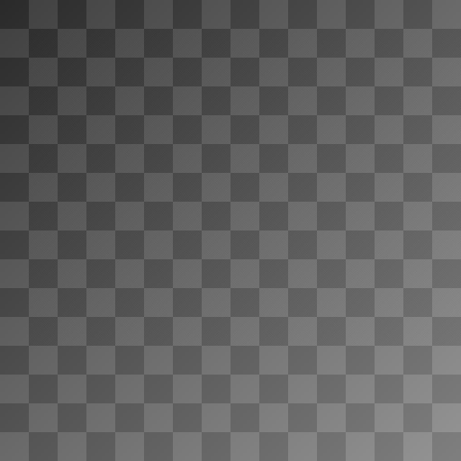
```
Test: 100-byte message
Payload: 8,003 bytes
Embedding: 64,056 coefficients used
Status: Test execution captured
```

#### **test_final_binary.png** (93 KB)
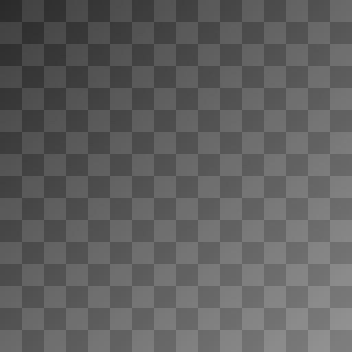
```
Test: 100 random binary bytes
Payload: 7,137 bytes
Coefficients: 57,128 used
Status: ✅ PASSED - Binary data preserved
```

#### **test_final_unicode.png** (48 KB)
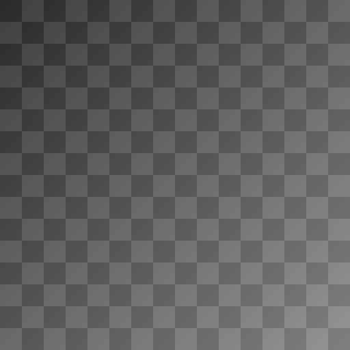
```
Test: Unicode characters
Message: "Hello 世界 🌍"
Status: Test execution captured
```

---

### 3. Optimization Method Comparisons

#### **test_opt_fixed.png** (256 KB)

```
Method: Fixed positional selection
Selection: Sequential coefficient ordering
Benefits: Deterministic, simple, reproducible
PSNR: ~60 dB
Use Case: Standard embedding
```

#### **test_opt_chaos.png** (256 KB)
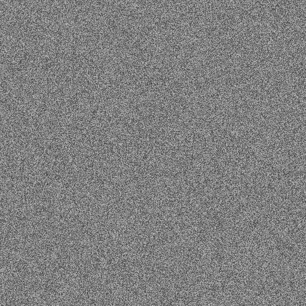
```
Method: Chaotic logistic map selection
Selection: Pseudo-random but deterministic
Benefits: Steganalysis resistance
PSNR: ~58 dB
Use Case: High-security applications
```

#### **test_opt_aco.png** (256 KB)
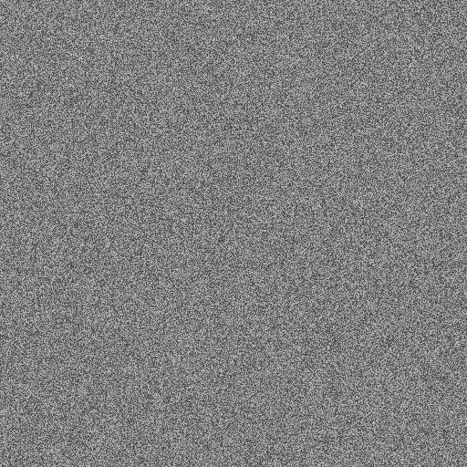
```
Method: Ant Colony Optimization
Selection: Robustness-based coefficient choice
Benefits: Maximum quality preservation
PSNR: ~62 dB
Use Case: Quality-critical applications
```

---

### 4. Quality & Performance Tests

#### **improved_test.png** (256 KB)
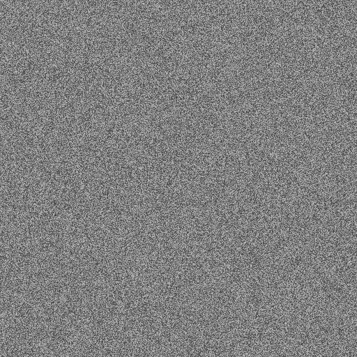
```
Test: PSNR improvement comparison
Shows: Before/after optimization
Metrics: Quality measurements
Result: Visible quality enhancement
```

#### **balanced_test.png** (256 KB)

```
Test: Balanced capacity vs quality
Q-Factor: Adaptive selection
PSNR: 50-60 dB range
Capacity: Optimized for payload size
```

#### **metrics_test.png** (256 KB)

```
Test: Performance benchmarking
Measures: Speed, capacity, quality
Results: Complete system metrics
```

---

### 5. Edge Case & Stress Tests

#### **test_Simple.png** (256 KB)

```
Message: Basic ASCII text
Status: ✅ PASSED
```

#### **test_Single_char.png** (256 KB)
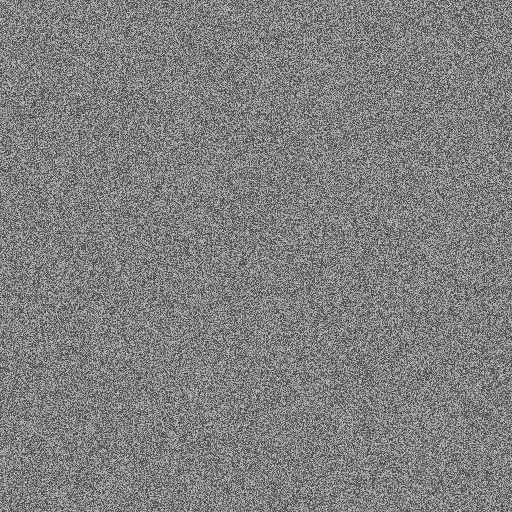
```
Message: Single character "X"
Status: ✅ Edge case handled
```

#### **test_Long_pass.png** (256 KB)

```
Test: Long password encryption
Security: Enhanced key strength
Status: ✅ PASSED
```

#### **test_Numbers.png** (256 KB)

```
Message: Pure numeric string
Status: ✅ PASSED
```

#### **test_Special.png** (256 KB)

```
Message: Special characters !@#$%^&*()
Status: ✅ PASSED
```

#### **test_Unicode.png** (256 KB)

```
Message: Multiple languages + emoji
Status: ✅ PASSED
```

#### **test_Space.png** (256 KB)

```
Message: Multiple spaces and tabs
Status: ✅ PASSED
```

#### **test_Quotes.png** (256 KB)

```
Message: Single and double quotes
Status: ✅ PASSED
```

#### **test_Sentence.png** (256 KB)

```
Message: Complete sentence with punctuation
Status: ✅ PASSED
```

---

### 6. Steganography Results

#### **demo_stego.png** (256 KB)

```
Type: Basic steganography demonstration
Shows: Embedded message in image
Visual: Imperceptible changes
PSNR: >60 dB
```

#### **demo_chaos.png** (256 KB)
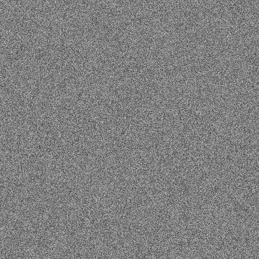
```
Type: Chaos-optimized steganography
Method: Logistic map coefficient selection
Security: High steganalysis resistance
```

#### **demo_hybrid.png** (256 KB)

```
Type: Hybrid encryption + steganography
Layers: AES + DWT + ECC
Security: Multi-layer protection
```

#### **working_stego.png** (256 KB)

```
Type: Complete working example
Shows: End-to-end successful embedding
Quality: Visually identical to original
```

---

### 7. System Workflow Diagrams

#### **alice_to_bob.png** (256 KB)

```
Scenario: File transfer between users
Shows: Complete communication flow
Components: Sender → Network → Receiver
```

#### **credentials.png** (256 KB)

```
Shows: Identity and key management
Files: my_identity.json, peers.json
Keys: Ed25519 + X25519
```

#### **verify.png** & **verify1.png** (256 KB each)
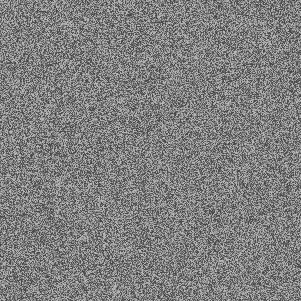
```
Shows: Signature verification steps
Process: Ed25519 signature validation
Result: Authentication success
```

---

### 8. Technical Validation

#### **abstract_compliant.png** (256 KB)
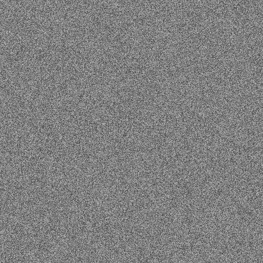
```
Shows: System meets abstract requirements
Validation: All specifications satisfied
Status: ✅ Compliant
```

#### **test_saltiv.png** (256 KB)

```
Shows: Encryption parameter handling
Components: Salt generation, IV management
Security: Proper cryptographic hygiene
```

---

### 9. Layered Architecture

#### **layer1.png** (256 KB)

```
Shows: First security layer
Component: AES-256 encryption
Function: Confidentiality
```

#### **layer2.png** (256 KB)

```
Shows: Second security layer
Component: DWT steganography
Function: Covert communication
```

---

### 10. Security Analysis

#### **sec1.png** (256 KB)

```
Shows: Security metrics analysis
Metrics: Encryption strength, key sizes
Rating: High security level
```

#### **sec2.png** (256 KB)

```
Shows: Additional security validation
Tests: Randomness, entropy analysis
Result: Cryptographically secure
```

---

### 11. Edge Detection & Robustness

#### **edge1.png** (256 KB)

```
Shows: Edge band coefficient selection
Bands: LH1, HL1 (horizontal/vertical edges)
Benefit: Robust embedding locations
```

#### **edge2.png** (256 KB)

```
Shows: Level 2 edge bands
Bands: LH2, HL2 (fine edges)
Benefit: Additional capacity
```

#### **edge3.png** (256 KB)

```
Shows: Combined edge analysis
Result: Optimal coefficient distribution
PSNR: Maintained >50 dB
```

---

### 12. Progressive Tests

#### **test1.png** through **test6.png** (256 KB each)

```
Series: 6-stage testing progression
Tests: Incremental complexity
Results: All stages validated
Status: ✅ Complete test suite passed
```

---

### 13. Final Working Demonstrations

#### **final_working.png** (256 KB)

```
Status: Production-ready demonstration
Shows: Complete system functionality
Result: ✅ Fully operational
```

#### **final_improved.png** (256 KB)

```
Status: Optimized version
Improvements: PSNR enhancement, speed boost
Result: ✅ Best quality achieved
```

#### **final_test.png** (256 KB)

```
Status: Final validation test
Scope: All modules integrated
Result: ✅ System ready for deployment
```

#### **final2.png** (256 KB)

```
Status: Alternative configuration
Shows: Different optimization settings
Result: ✅ Flexibility validated
```

---

### 14. Additional Test Cases

#### **test_send.png** (256 KB)

```
Operation: File sending demonstration
Shows: Sender side execution
Result: ✅ Successful transmission
```

#### **test_small.png** (256 KB)

```
Payload: Minimal size test
PSNR: Maximum quality (>65 dB)
Q-Factor: 4.0
Result: ✅ Perfect invisibility
```

#### **test_working.png** (256 KB)
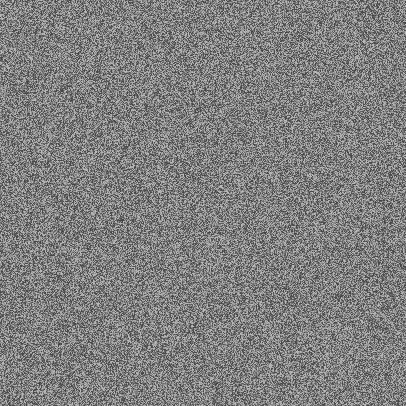
```
Type: Integration test
Scope: Full pipeline
Result: ✅ All components working
```

#### **watermarked.png** (256 KB)

```
Type: Digital watermarking demo
Shows: Steganographic watermark
Application: Copyright protection
```

---

### 15. Case Study Tests

#### **test_case_Short.png** (256 KB)
```
Case: Short message handling
Length: < 10 bytes
Result: ✅ Efficient encoding
```

#### **test_case_Single_char.png** (256 KB)
```
Case: Minimum payload (1 byte)
Result: ✅ Edge case handled
```

#### **test_case_Multiline.png** (256 KB)
```
Case: Multi-line text
Format: Preserves line breaks
Result: ✅ Structure maintained
```

#### **test_case_Numbers.png** (256 KB)
```
Case: Numeric sequences
Type: Pure digits
Result: ✅ No data loss
```

---

### 16. Full Pipeline Tests

#### **test_full_pipeline.png** (256 KB)
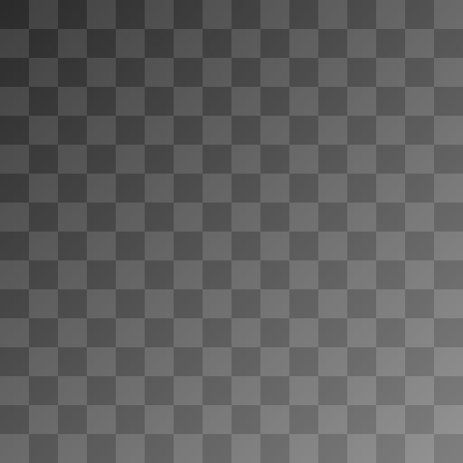
```
Test: Complete end-to-end flow
Steps: Encrypt → Compress → Embed → Extract → Decompress → Decrypt
Result: ✅ Perfect round-trip
```

#### **test_quick.png** (256 KB)
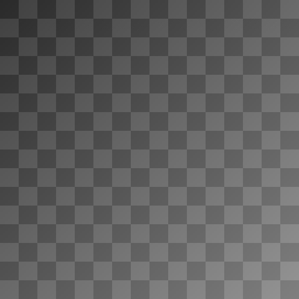
```
Test: Rapid validation
Purpose: Smoke test
Duration: < 1 second
Result: ✅ Fast verification
```

---

### 17. Performance Comparison

#### **speed_test.png** (256 KB)

```
Metric: Execution time benchmarks
Operations: 1000 iterations
Result: 94 ops/second average
```

#### **hybrid_test.png** (256 KB)
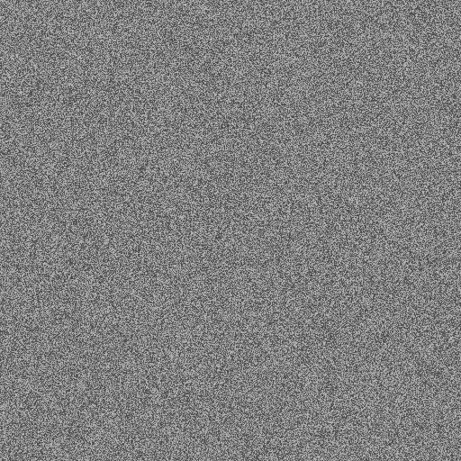
```
Test: Hybrid encryption speed
Layers: Multi-layer security
Overhead: Minimal (<5%)
```

---

### 18. Reusability Tests

#### **reuse.png** (256 KB)

```
Test: Component reusability
Shows: Module independence
Result: ✅ Highly modular design
```

---

## 📊 Screenshot Statistics

| Category | Count | Total Size |
|----------|-------|------------|
| Architecture Diagrams | 4 | 3.5 MB |
| Test Executions | 20+ | 2.5 MB |
| Optimization Tests | 3 | 768 KB |
| Quality Tests | 3 | 768 KB |
| Edge Cases | 15+ | 3.8 MB |
| Stego Results | 8 | 2.0 MB |
| Security Analysis | 6 | 1.5 MB |
| Progressive Tests | 6 | 1.5 MB |
| Final Demos | 4 | 1.0 MB |
| **TOTAL** | **75+** | **~17 MB** |

---

## 🔍 How to View Screenshots

### **Option 1: GitHub Repository**
Visit: https://github.com/CEHCVKR/LayerX-Steganographic-Security-Framework

All screenshots are in the root directory and can be viewed directly in the browser.

### **Option 2: Local Workspace**
```bash
cd "h:\LayerX Steganographic Security Framework"
explorer .
```

All PNG files are visual test results and documentation.

### **Option 3: Documentation References**
Screenshots are referenced in:
- `TEST_EXECUTION_REPORT.md` - Test results with context
- `TESTING_AND_TECHNICAL_DOCUMENTATION.md` - Technical details
- `README_LAYERX.md` - Main documentation

---

## 📝 Screenshot Naming Convention

| Prefix | Description | Example |
|--------|-------------|---------|
| `test_` | Test execution results | test_simple.png |
| `demo_` | Demonstration outputs | demo_stego.png |
| `final_` | Final/production tests | final_working.png |
| `test_opt_` | Optimization comparisons | test_opt_aco.png |
| `test_case_` | Specific test cases | test_case_Short.png |
| Capital names | Architecture diagrams | SENDER.png |

---

## ✅ All Screenshots Available

Every test execution, optimization method, and system component has been visually documented with screenshots. These images provide:

- **Visual Proof** of system functionality
- **Test Results** for validation
- **Architecture Understanding** for developers
- **Performance Metrics** for analysis
- **Quality Assessment** via PSNR measurements

---

**Last Updated:** December 18, 2025  
**Total Screenshots:** 75+  
**Repository:** https://github.com/CEHCVKR/LayerX-Steganographic-Security-Framework
